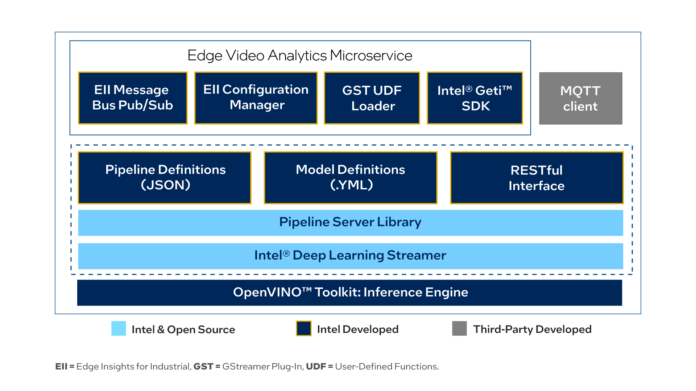

# Edge Video Analytics Microservice
Deploy optimized video analytics piplines. Discover, start, stop, customize, and monitor the pipeline execution with RESTful APIs.
## Overview
Video Analytics refers to transforming the video streams into insights through video processing, inference, and analytics operations. Video Analytics is used in business domains such as video surveillance, healthcare, retail, entertainment, and industrial. The algorithms used for video analytics perform object detection, classification, identification, counting, and tracking on the input video stream.

This use case features interoperable containerized microservices for developing and deploying optimized video analytics pipelines built using [Intel® DL Streamer](https://github.com/dlstreamer/dlstreamer) as an inferencing backend. The pre-built container images provided by the package allow developers to replace the deep learning models and pipelines used in the container with their deep learning models and pipelines. You can deploy the microservices independently (as explained here) or with the [Intel® Edge Insights for Industrial (EII)](https://www.intel.com/content/www/us/en/developer/topic-technology/edge-5g/edge-solutions/industrial-recipes.html) software stack to perform video analytics on the edge devices.

Developers can save the development and deployment time using the pre-built Docker* image and configuring the video analytics pipelines in the well-known JSON format.

## How It Works

This is a Python* microservice which is used for deploying optimized video analytics pipelines and is provided as a Docker image in the package. The pipelines run by the microservice are defined in GStreamer* using the [Intel® DL Streamer](https://github.com/dlstreamer/dlstreamer) Pipeline Server for inferencing. The Docker image uses [Intel® DL Streamer Pipeline Server](https://github.com/dlstreamer/pipeline-server) as a library. Edge Video Analytics Microservice provides the same RESTful APIs as Intel® DL Streamer Pipeline Server to discover, start, stop, customize, and monitor pipeline execution and supports MQTT and Kafka message brokers for publishing the inference results. This document explains the EVA mode. For the REST API definition, refer to the [RESTful Microservice interface](https://github.com/dlstreamer/pipeline-server/blob/main/docs/restful_microservice_interfaces.md).

<figure>
  
  <figcaption>High-level architecture diagram of Data Collection as a Service.</figcaption>
</figure>

